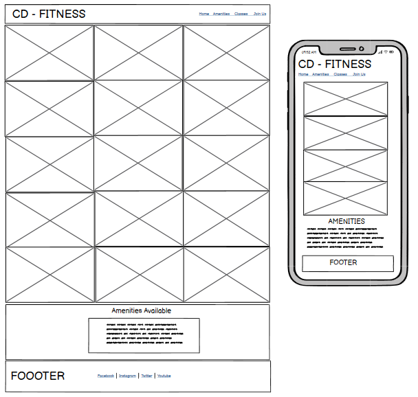
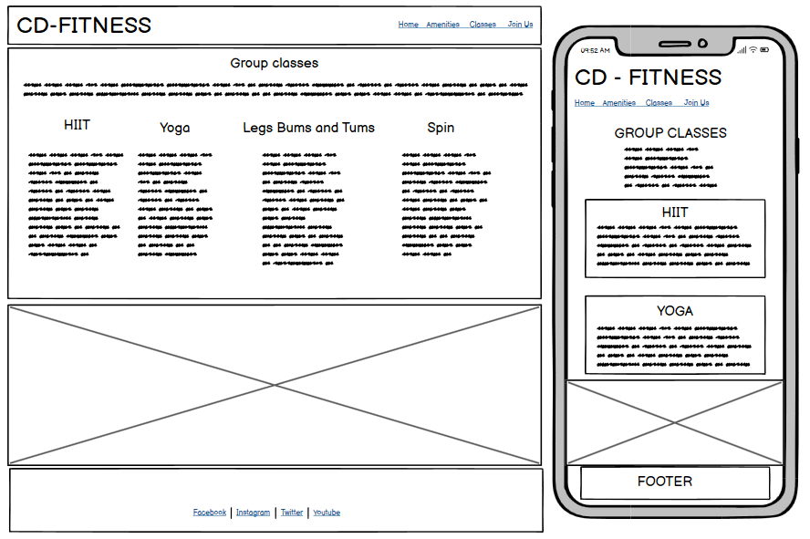
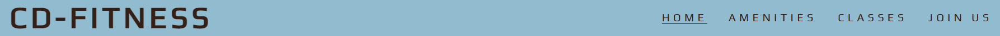
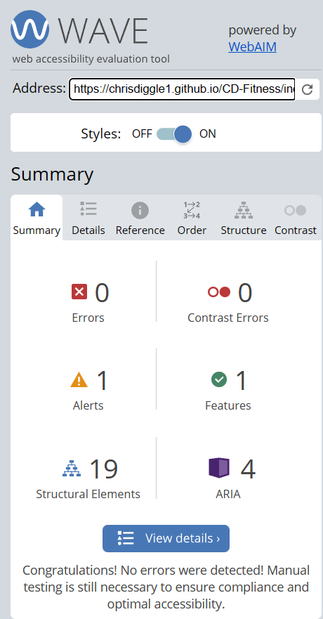
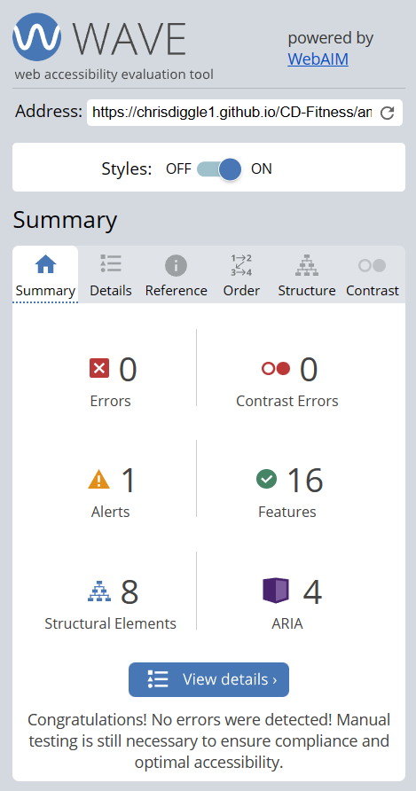
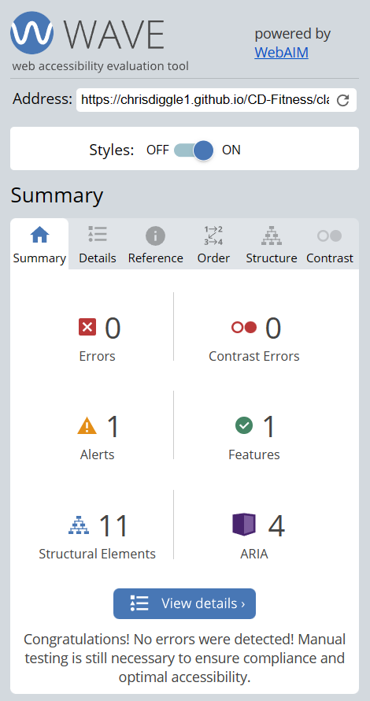
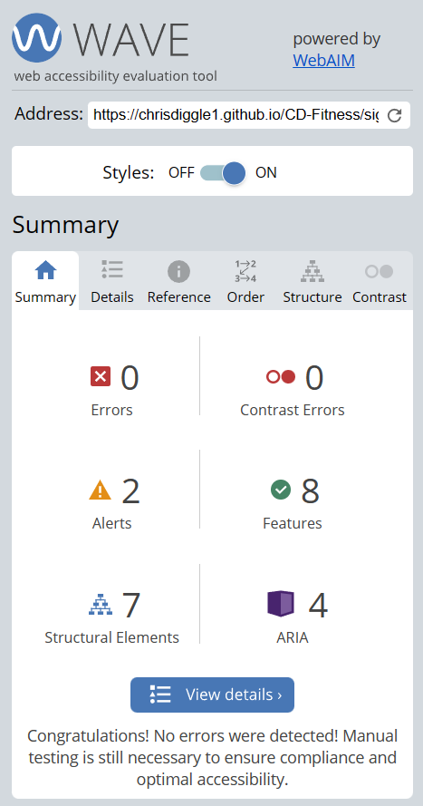
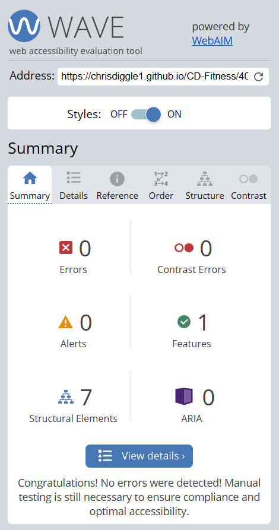

# **CD-FITNESS**

This website has been built for my first portfolio project and is for educational purposes only. The website is a static website using HTML and CSS. 

For this project I have decided to build a website based on a ficticious gym as fitness is somthing I value. The name CD - Fitness has been used simply from using my own initials.

The site is aimed to attract customers, with a nice easy to read layout, complimenting colour scheme, and providing all the information a potential new customer would need to make the decision to sign up.

## **Live Site**

**[Live Website](https://chrisdiggle1.github.io/CD-Fitness/)**

## **Contents**

1. [User Experience (UX)](#User-Experience (UX)) 
    - [First-Time User](#First-Time-User)
    - [Returning User](#Returning-User)
    - [Site Owner](#Site-Owner)
    
2. [Target Audience](#Target-Audience)

3. [Design](#Design)
    - [Website Structure](#Website-Structure)
    - [Colour Scheme](#Colour-Scheme)
    - [Typography](#Typography)

4. [Page Features](#Page-Features)
    - [Header](#Header)
    - [Footer](#Footer)
    - [Home Page](#Home-Page)
    - [Amenities Page](#Amenities-Page)
    - [Classes Page](#Classes-Page)
    - [Join Us Page](#Join-Us-Page)
    - [Thank You Page](#Thank-You-Page)
    - [404 Page](#404-Page)
    - [Favicon](#Favicon)

5. [Accessibility](#Accessibility)

6. [Technologies Used](#Technologies-Used)
    - [Languages](#Languages)
    - [Frameworks and tools](#Frameworks-and-tools)

7. [Testing and Validation](#Testing-and-Validation)
    - [W3C Markup Validation](#W3C-Markup-Validation)
    - [W3C Jigsaw CSS Validation](#W3C-Jigsaw-CSS-Validation)
    - [Lighthouse Tests](#Lighthouse-Tests)
    - [WAVE](#WAVE)

8. [Deployment](#Deployment)

9. [Credits](#Credits)
    - [Code](#Code)
    - [Images](#Images)
    - [Content](#Content)
    - [Acknowledgements](#Acknowledgements)

## **User Experience (UX)**

### **First-time User**

As a first time user, I want to ...

1. Easily be able to navigate through the site.
2. Understand clearly what memberships the gym has to offer.
3. Find out how to contact the gym for more information.
4. See what classes are on and what times.
5. Locate socail media links to see followings and cooments/reviews.

### **Returning User**

As a returning user, I want to...

1. See if any new clases have been added or times have changed.
2. View the social media links to connect with the gym and other members.
3. See if there are any offers for existing members.
4. Find directions to the gym.
5. View updates to any of the amenities.

### **Site Owner**

As the site owner, I want the users to ...

1. To navigate easily through the site.
2. Learn what services are on offer, what classes are available and memebership options we have.
3. Feel comforatable reaching out to the gym for further information or to report any issues.

## **Target Audience** 

I have designed this website with the intention to target everyone, from all walks of life. I 
want to attract newcomers who have never been to a gym before, aswell as regulars to a gym who
would like to try out a new gymm. I want the website to be specific in what amenities and classes
we have on offer. The amenities page has a clear visualisation of what we have in the gym and the 
classes page to clearly state what classes we currently run.  

## **Design**

### **Website Structure**

##### Balsamiq Wireframes

The website has 6 pages. 4 pages are accessible by selecting a link in the header,
and there is also a thank you page you are dirceted to when you fill in the sign up form and hit the 'lets go' button, and a 404 error page if the URL is incorrectly input. 

Homepage Wireframe

 

Amenities Page Wireframe

 

Classes Page Wireframe

 

Join Us Page Wireframe

### **Colour Scheme**

The colour scheme of the website was decided by asking my children to pick a colour for my background. They both decided they wanted Sky Blue, so from that I picked Bistre for the headings to stand out against the blue background. Light Coral has been used with an opaque effect on the home page, join us and thank you pages.

### **Typography**

I chose to use the Play font. I beleive this font has a sporty look about it and fits well with the theme of the site.
The Play font is a sans serif font which is great for accessibility and dyslexic users.

I used google fonts to import the fonts for this project.

## **Page Features**

### **Header**

View the header

* The header is featured on all pages on the webiste.

* The header contains the brand name and logo and links to the home page, amenities page, classes page and sign up page. 

* Each link in the header is underlined when the user hovers over it. 

### **Footer**

View the footer

* The footer is featured on all pages on the website with the exception of the 404 page.

* The footer has links to the most commonly used social media sites which CD-Fitness members use.

* Each link opens the page in a new tab when selected.

### **Home Page**

* Contains an image of a male and female working out in the gym. this is to grab the users attention when the page first laods.

* The image also has some text overlay with an opaque background to stand out on the page.

* Cantains four reasons why the user should join us, with a decription of each of the benefits. 

* Displays the meberships and costs that are on offer.

### **Amenities Page**

* Displays 15 images of the amenities the gym has to offer customers. this is  to provide a pleasant visual to users looking at joining the gym.

* Displays a list with bullet points of the amenities on offer at the gym under the images, this is to state exactly what we have inside.

### **Classes Page**

* Displays a description stating that the gym has group classes on offer and to to join like minded people having fun whilst getting fit.

* Displays the 4 group classes that are currently being run and a description of what each class is.

* the page has a large image of a group class underneath the description of the classes.

### **Join Us Page**

* Contains a large image of a male workign out using battle ropes.

* The page has a sign up form with opaque stying in which the user needs to fill in their first name, last name and email address and choose a membership by clicking the radio button next to the desired choice.

* Once the user has filled in their details and chose the membership they would like, they press the 'Lets Go!' button, this directs the user to a thank you page confirming the sign up.

### **Thank You Page**

* The user is directed to this page once they have singned up and submitted their form.

* This page has a same style as the signup page, this has a large background image, with an opaque styled box over the top, welcoming the user to the CD-Fitness family, and letting them know they will automatically be re-directed to the home page.

### **404 Page**

View of the 404 error

* The site has a basic 404 error page which the user is directed to if the URL is input incorrectly.

* The error states the page can't be found and instructs the user to click a link in the header to go back to the main site.

### **Favicon**

Favicon

* All pages on the site have a Favicon. The Favicon contains the letters CDF and uses the colour theme from the main site, with a Sky Blue background and the letters in Bistre.

## **Accessibility**

I have tried to ensure the website is accessible friendly as possible. I have tried to achive this by:

* Using Semantic HTML
* Using descriptive alt attributes on images on the site.
* Ensuring that there is a sufficient colour contrast throughout the site.

## Technologies Used

### Languages

* HTML 
* CSS

### Frameworks and tools

* Git - Used for version control.
* GitHub - Used to save and store the files for the site.
* Balsamiq Wireframe - Used to design the layout of the site.
* CodeAnywhere - The cloud IDE used to write all my code.
* Google Fonts - Used to import the fonts used on the site.
* Font Awesome - The icons on the site are used from here.
* W3Schools - Used to help when stuck with an issue.
* W3C validator - Used to check and validate html code.
* Jigsaw validator - Used to check and validate css code
* [Am I responsive](http://ami.responsivedesign.is/) - To show website image on different devices.
* Favicon.io - Used to create the Favicon for the site.
* Google Dev Tools - To troubleshoot and test features, solve issues with responsiveness and styling.
* [Convertio.co](https://convertio.co/) - Used to convert images to webp.

## Testing and Validation

The [W3C](https://validator.w3.org/) Markup Validation Service was used to validate the HTML on all pages of the website. All pages passed with no errors or warnings.

Home Page

 

Amenities Page

 

Classes Page

 

Signup Page

 

Thank You Page

 

404 Error Page

 

The [W3C Jigsaw](https://jigsaw.w3.org/css-validator/) CSS Validation Service was used to validate the CSS code for the site. The code passed with no errors or warnings.

CSS Validation

 

### **Lighthouse Tests**

The Lighthouse tool on Google DevTools was used to test the accessibility and performance of the 4 main pages of the site. The pages were tested for mobile and desktop and recieved high scores in all the required areas.

### **Desktop**

Home Page

 

Amenities Page

 

Classes Page

 

Signup Page

 

### **Mobile**

Home Page

 

Amenities Page

 

Classes Page

 

Signup Page

 

### **WAVE**

Each page was run through the Web Accessibility Evalulation Tool (WAVE).

The alerts on the pages are due to the text on the footer not being listed as a header and is a paragraph instead with bigger font-size. This was changed after coming up with a warning the first time I ran the page through the HTML validator.

The error on the thankyou page is because I have set the page to automatically re-direct the user back to the homepage after 10 seconds of displaying the page

Home Page

 

Amenities Page

 

Classes Page

 

Signup Page

 

Thank You Page

 

404 Error Page

## Deployment

The site is deployed using GitHub pages. To do this please follow the below steps - 

1. Login to GitHub.
2. Select the repository for the site you wish to deploy.
3. Click on "Settings" on the navigation bar under the repository title.
4. Click on 'pages' shown on the left side navigation bar.
5. Under the 'build and deployment' title, and the 'branch' heading, use the drop down and select 'main'.
6. Select the /root folder to deply from.
7. Click "Save", then wait for it to be deployed. Please note it can take some time for the page to be fully deployed.
8. 
The URL for the deployed site will be shown above 'source'.

To Fork the repository, please follow the below steps - 

1. Login to GitHub.
2. Select the repository for the project you wish to fork.
3. Click the fork botton in the top right-hand corner.

To clone the repository, please follow thw below steps - 

1. Login to GitHub.
2. Select the repository for the project you wish to clone.
3. Click on the code button and choose whether you would like to clone with HTTPS, SSH or GitHub CLI and copy the link shown.
4. Open a new terminal in the IDE used and change the current working directory to the location you want to use for the cloned directory.
5. Type 'git clone' into the terminal and then paste the link you copied in step 3 then press enter.

## Credits

### **Code**

* With this being my 1st project, I took inspiration for the design and layout from the Love Running Walkthrough project on the Code Institute LMS, and some of the code was used and modified for this project.

* This README file was created using Kera Cudmores [earth-day-hackathon-2022 README](https://github.com/kera-cudmore/earth-day-hackathon-2022#Design) as a guide.

* [W3Schools](https://www.w3schools.com/), [Stack Overflow](https://stackoverflow.com/), the Slack community and my HTML, CSS and Javascrpit book written by Mike McGrath, were used regularly for any issues I came across with my code.

### **Images**

* All images on the Amenities page were taken from https://www.pexels.com/

* The home page image was taken from https://www.pexels.com/search/gym/

* The icons for the gym ethos were taken from font awesome - https://fontawesome.com/

* The sign-up page image was taken from - https://unsplash.com/s/photos/man-and-women

* The thank-you page image was taken from - https://unsplash.com/s/photos/man-and-women

### **Content**

* The text written in the 'Why Join Us' section was taken from - https://myadvancefitness.com/7-benefits-of-a-gym-membership/

* The text for the description of the classes was taken from the below - 

   **HIIT** - https://en.wikipedia.org/wiki/High-intensity_interval_training

   **Yoga** - https://www.healthline.com/nutrition/13-benefits-of-yoga

   **Legs, Bums and Tums** - https://www.nuffieldhealth.com/gyms/classes/legs-bums-tums#:~:text=Legs%2C%20bums%20and%20tums%20is%20a%20full%20body,who%20simply%20want%20to%20improve%20their%20fitness%20levels.

   **Spin** - https://biketips.com/spin-class-guide/

### **Acknowledgements**

I would like to thank the below during my time doing this project - 

* My Mentor Greame Taylor for his guidance, tips, support and feedback during this first project.

* My wife Kirsty for her support during this first project, taking the kids out so I can stdy in peace, bringing regular coffee to keep me going and telling me to take a break when I struggled with an issue.

* My kids for wanting to be part of the project and choosing the colours and picking out the images on the site, also for being good as gold and letting me do my studies without much hassle.

* The Slack community for when you need help, a laugh or to help somebody else out. 

